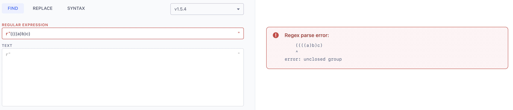
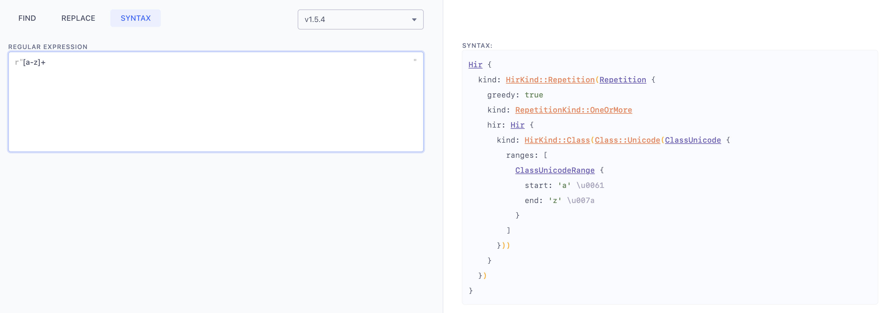
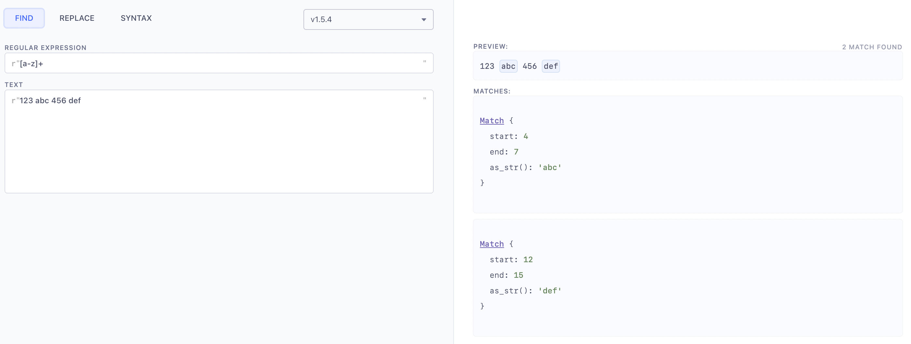
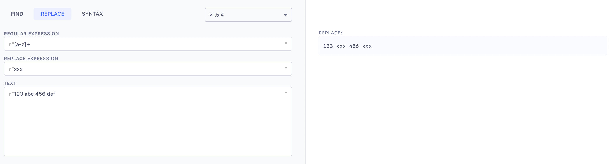

# RUST REGEX PLAYGROUND

Web tool to evaluate rust regular expressions using [rregex](https://github.com/2fd/rregex)

## Detect parse errors

## Evaluate syntax

## Preview find and matches

## Preview replace

