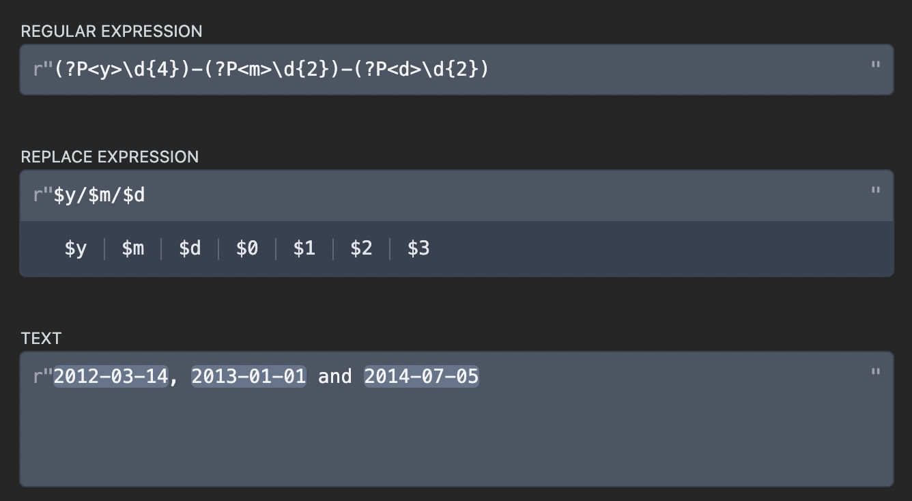

# RUST REGEX PLAYGROUND

Web tool to evaluate rust regular expressions using [rregex](https://github.com/2fd/rregex)

## Preview replacement, find, matches

## Preview named matches

## Evaluate syntax

## Detect parse errors

